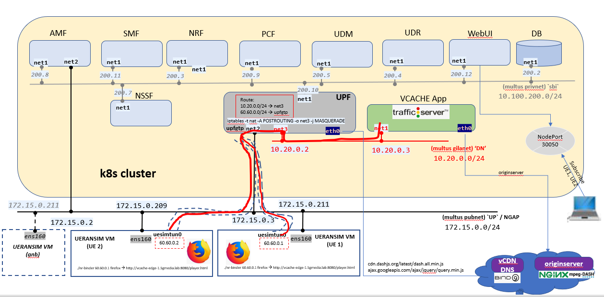

# free5gc-k8s

Deploy k8s cluster via [these instructions](docs/kubernetes.md)

Create two fresh **Ubuntu 20.04** VMs: 4 vCPU, 8 GB RAM, 50 GB for (gnb, ue)

**Description:** this testbed assumes 5GC + UPF + DN network running in a single k8s cluster and GNB/UE in VMs. A provider network is assumed where k8s cluster nodes and GNB/UE are connected to

Provider subnet: `172.15.0.0/24`
k8s master: `172.15.0.170`
k8s node1: `172.15.0.171`
k8s node2: `172.15.0.172`

gnb/ue VM: `172.15.0.211`
ue VM: `172.15.0.209`

AMF N2: `172.15.0.2`
UPF N3: `172.15.0.3`
UPF N6: `10.20.0.2`



**Important note for ESXi**

For macvlan to properly work connecting the containers and pods to the already existing provider network:

1. Log into your ESXi management UI

1. Expand: "Networking"

1. Select: "vSwitch1"

1. At the upper layer of the page: select "Edit settings"

1. Expand: "Security" section

1. Set with Accept the below options:

  ```
  Promiscuous mode
  MAC address changes
  Forged transmits
  ```

**Important note for deployment**

Ensure no other services or stale deployments exist in the platform to avoid overlapping of ipaddresses.

## K8s networking

### Multus

Log into k8s master

[Installation](https://github.com/k8snetworkplumbingwg/multus-cni/blob/master/docs/quickstart.md#installation)

Wait for multus pods to become active

### Whereabouts

Log into k8s master

[Installation](https://github.com/k8snetworkplumbingwg/whereabouts#installing-whereabouts)

Wait for whereabouts pods to become active

## gtp5g kernel module

On every k8s node perform the below in this order

### Install pre-requisites

```
sudo apt-get install libtool
sudo apt-get install pkg-config
sudo apt-get install libmnl-dev
sudo apt install make
sudo apt install net-tools
```

### Build and install

```
cd ~
git clone https://github.com/PrinzOwO/gtp5g && cd gtp5g
git checkout tags/v0.3.2
make clean && make
sudo make install
```

### Add additional network interface

Using your hypervisor management tool (e.g. esxi) edit the VM to add additional interface

**Important:** the newly interface should be set with the same name across all k8s node VMs; interface is being used as the master for macvlan

Run the below replacing interface name accordingly

```
sudo ip link set ens192 promisc on
sudo ifconfig ens192 up
```

## UERANSIM

Log into UERANSIM VMs (i.e. 172.15.0.211, 172.15.0.209)

### Clone UERANSIM

```
cd ~
git clone https://github.com/aligungr/UERANSIM.git
cd UERANSIM
git checkout tags/v3.2.0 -b v3.2.0-branch
```

### Install UERANSIM

**Note:** Install from tag `v3.2.0`

Follow [installation](https://github.com/aligungr/UERANSIM/wiki/Installation)

## Ubuntu - GUI

Log into UERANSIM VMs (i.e. 172.15.0.211, 172.15.0.209)

### Install GUI

```
sudo apt-get install tasksel
tasksel --list-task
sudo tasksel install ubuntu-mate-core
sudo service lightdm start
```


## free5gc images

Log into host installed with docker and has access to artifactory.haifa.ibm.com:5130

**Note:** ensure to build images out from free5gc `v3.0.5`

## Build

```
cd ~
git clone https://github.com/free5gc/free5gc-compose.git
cd free5gc-compose
make base
docker-compose build
```

### Tag and Push to registry

Ensure to properly tag the images built from the previous step - into the below names

```
artifactory.haifa.ibm.com:5130/weit/free5gc-udr
artifactory.haifa.ibm.com:5130/weit/free5gc-udm
artifactory.haifa.ibm.com:5130/weit/free5gc-smf
artifactory.haifa.ibm.com:5130/weit/free5gc-pcf
artifactory.haifa.ibm.com:5130/weit/free5gc-nssf
artifactory.haifa.ibm.com:5130/weit/free5gc-ausf
artifactory.haifa.ibm.com:5130/weit/free5gc-amf
artifactory.haifa.ibm.com:5130/weit/free5gc-nrf
artifactory.haifa.ibm.com:5130/weit/free5gc-upf
```

then push them with `docker push ...`

### Install additional tools into UPF

```
docker build --tag artifactory.haifa.ibm.com:5130/weit/free5gc-upf-tools --force-rm=true -f ./Dockerfile.upf .
```

then push it with `docker push ...`

### Private registry

Review the [following readme](docs/registry.md) for using a private registry in your deployment

## Deployment options

the following deployment options are supported. Follow instructions in the links and proceed with the below sections..

* Single slice with single UPF - [here](deploy/oneSliceSingleUpf)
* Two slices with single UPF - [here](deploy/twoSliceSingleUpf)
* Two slices with two UPFs - [here](deploy/twoSliceTwoUpf)
* Single slice with single UPF (Fix IP deployment) - [here](deploy/oneSliceSingleUpf-Fix-IPs)
* Two slices (coredns A records with File plugin) - [here](deploy/twoSliceTwoUpf-coredns)
* Two slices (coredns A records with kubernetes plugin) - [here](deploy/twoSliceTwoUpf-coredns-endpoints)

## Deployment option - 5G Operators

Refer [here](deploy/5GOperator) for more instructions

## Start gnb sim

Log into UERANSIM VM (172.15.0.211)

Customize free5gc-gnb.yaml to support the two slices (010203, 112233)

```diff
index 81bb13b..e28f0be 100644
--- a/config/free5gc-gnb.yaml
+++ b/config/free5gc-gnb.yaml
@@ -5,13 +5,13 @@ nci: '0x000000010'  # NR Cell Identity (36-bit)
 idLength: 32        # NR gNB ID length in bits [22...32]
 tac: 1              # Tracking Area Code

-linkIp: 127.0.0.1   # gNB's local IP address for Radio Link Simulation (Usually same with local IP)
-ngapIp: 127.0.0.1   # gNB's local IP address for N2 Interface (Usually same with local IP)
-gtpIp: 127.0.0.1    # gNB's local IP address for N3 Interface (Usually same with local IP)
+linkIp: 172.15.0.211   # gNB's local IP address for Radio Link Simulation (Usually same with local IP)
+ngapIp: 172.15.0.211   # gNB's local IP address for N2 Interface (Usually same with local IP)
+gtpIp: 172.15.0.211    # gNB's local IP address for N3 Interface (Usually same with local IP)

 # List of AMF address information
 amfConfigs:
-  - address: 127.0.0.1
+  - address: 172.15.0.2
     port: 38412

 # List of supported S-NSSAIs by this gNB
 slices:
   - sst: 0x1
     sd: 0x010203
+  - sst: 0x1
+    sd: 0x112233

 # Indicates whether or not SCTP stream number errors should be ignored.
 ignoreStreamIds: true
```

start gnb

```
cd ~/UERANSIM/build
./nr-gnb  -c ../config/free5gc-gnb.yaml
```

## PDU session (UE 1)

Log into UERANSIM VM (172.15.0.211)

```bash
sudo -s
cd ~/UERANSIM/build
./nr-ue -c ../config/free5gc-ue.yaml
```

**Note:** if you are using deployment [twoSliceInternetLocalDN](deploy/twoSliceInternetLocalDN), create another session (`free5gc-ue-2nd-slice.yaml`) to use slice `1/112233` for retrieving content from vcache

from a new terminal

```bash
sudo -s
cd ~/UERANSIM/build
./nr-ue -c ../config/free5gc-ue-2nd-slice.yaml
```


## PDU session (UE 2)

Log into UERANSIM VM (172.15.0.209)

```
sudo -s
cd ~/UERANSIM/build
./nr-ue -c ../config/free5gc-ue.yaml
```

## Send data through userplane

Log into a UERANSIM VM (ue)

**Important:** it is assumed vcache is registered in vCDN DNS under `vcache-edge-1.5gmedia.lab`
**Note:** there was a change in latest `bind9` DNS where it does not allow recursion by default. This may affect nslookups done from UE(s). Refere [here](https://kb.isc.org/docs/aa-00269) for more details

* retrieve single segment from vcache

  ```
  curl --interface uesimtun0 http://vcache-edge-1.5gmedia.lab:8080/SpaceX_Launches_4K_Demo/segment_5.m4s
  ```

* retrieve content from vcache. Replace tune_i with name of tune tunnel device created in the UE endpoint

  ```
  cd ~/UERANSIM/build
  ./nr-binder <tune_i ipaddress> firefox
  ```

  point firefox to `http://vcache-edge-1.5gmedia.lab:8080/player.html`

* retrieve content from portal. cdn-lb.5gmedia.lab redirects to either originserver or vcache

  ```
  cd ~/UERANSIM/build
  ./nr-binder <tune_i ipaddress> firefox --devtools http://cdn-lb.5gmedia.lab
  ```

## Terminate NFs

Log into k8s master

cd into your proper deployment, then:

```
./stop.sh
```
