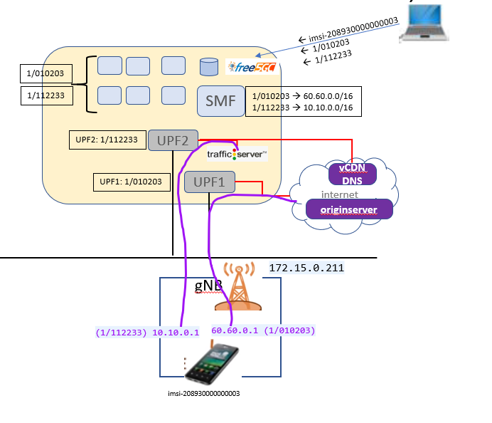

# Two Slice: Internet, local data network

Slice `1/010203`: a UPF with a connection to internet only

Slice `1/112233`: a UPF with a connection to data network and internet



## ue sim 1

Log into UERANSIM VM (172.15.0.211)

Customize free5gc-ue.yaml to use slice 010203

```diff
index 28b0baa..0ab1970 100644
--- a/config/free5gc-ue.yaml
+++ b/config/free5gc-ue.yaml
@@ -20,7 +20,7 @@ imeiSv: '4370816125816151'

 # List of gNB IP addresses for Radio Link Simulation
 gnbSearchList:
-  - 127.0.0.1
+  - 172.15.0.211

 # Initial PDU sessions to be established
 sessions:
@@ -38,7 +38,7 @@ configured-nssai:
 # Default Configured NSSAI for this UE
 default-nssai:
   - sst: 1
-    sd: 1
+    sd: 010203

 # Supported encryption algorithms by this UE
 integrity:
```

Customize free5gc-ue-2nd-slice.yaml to use slice 112233

```diff
index 28b0baa..0ab1970 100644
...
@@ -20,7 +20,7 @@ imeiSv: '4370816125816151'

 # List of gNB IP addresses for Radio Link Simulation
 gnbSearchList:
-  - 127.0.0.1
+  - 172.15.0.211

 # Initial PDU sessions to be established
 sessions:
@@ -28,17 +28,17 @@ sessions:
     apn: 'internet'
     slice:
       sst: 0x01
-      sd: 0x010203
+      sd: 0x112233

 # Configured NSSAI for this UE by HPLMN
 configured-nssai:
   - sst: 0x01
-    sd: 0x010203
+    sd: 0x112233

 # Default Configured NSSAI for this UE
 default-nssai:
   - sst: 1
-    sd: 1
+    sd: 112233

 # Supported encryption algorithms by this UE
 integrity:
```

## Deploy 5G Core (and upf, vcache app)

Log into k8s master

and run the below script that deploys the networks and NFs in the correct order

```
./startTwoSliceTwoUpf.sh
```

all components should be up and running and registered with each other


## Subscribe UE

Browse to `http://172.15.0.170:30050`
login with `admin/free5gc`

New subscriber -> accept all defaults -> Submit

**Please note:** the above UE already defined in SMF UE routes.
