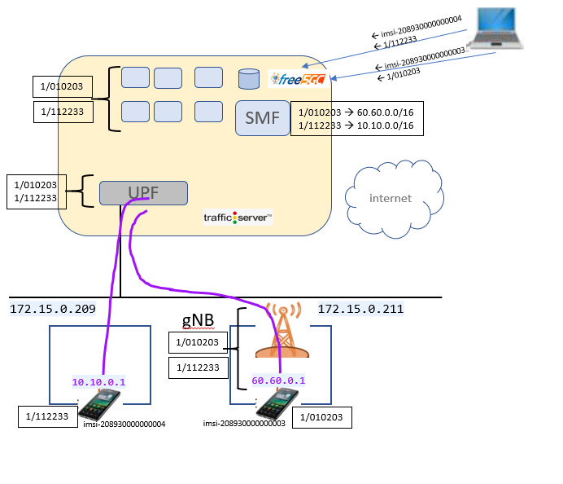

# Two Slice Single UPF



## ue sim 1

Log into UERANSIM VM (172.15.0.211)

Customize free5gc-ue.yaml to use slice 010203

```diff
index 28b0baa..0ab1970 100644
--- a/config/free5gc-ue.yaml
+++ b/config/free5gc-ue.yaml
@@ -20,7 +20,7 @@ imeiSv: '4370816125816151'

 # List of gNB IP addresses for Radio Link Simulation
 gnbSearchList:
-  - 127.0.0.1
+  - 172.15.0.211

 # Initial PDU sessions to be established
 sessions:
@@ -38,7 +38,7 @@ configured-nssai:
 # Default Configured NSSAI for this UE
 default-nssai:
   - sst: 1
-    sd: 1
+    sd: 010203

 # Supported encryption algorithms by this UE
 integrity:
```

## ue sim 2

Log into UERANSIM VM (172.15.0.209)

Customize free5gc-ue.yaml to use slice 112233

```diff
--- a/config/free5gc-ue.yaml
+++ b/config/free5gc-ue.yaml
@@ -1,14 +1,14 @@
 # IMSI number of the UE. IMSI = [MCC|MNC|MSISDN] (In total 15 or 16 digits)
-supi: 'imsi-208930000000003'
+supi: 'imsi-208930000000004'
 # Mobile Country Code value of HPLMN
 mcc: '208'
 # Mobile Network Code value of HPLMN (2 or 3 digits)
 mnc: '93'

 # Permanent subscription key
-key: '8baf473f2f8fd09487cccbd7097c6862'
+key: '8baf473f2f8fd09487cccbd7097c6863'
 # Operator code (OP or OPC) of the UE
-op: '8e27b6af0e692e750f32667a3b14605d'
+op: '8e27b6af0e692e750f32667a3b14605e'
 # This value specifies the OP type and it can be either 'OP' or 'OPC'
 opType: 'OPC'
 # Authentication Management Field (AMF) value
@@ -20,7 +20,7 @@ imeiSv: '4370816125816151'

 # List of gNB IP addresses for Radio Link Simulation
 gnbSearchList:
-  - 127.0.0.1
+  - 172.15.0.211

 # Initial PDU sessions to be established
 sessions:
@@ -28,17 +28,17 @@ sessions:
     apn: 'internet'
     slice:
       sst: 0x01
-      sd: 0x010203
+      sd: 0x112233

 # Configured NSSAI for this UE by HPLMN
 configured-nssai:
   - sst: 0x01
-    sd: 0x010203
+    sd: 0x112233

 # Default Configured NSSAI for this UE
 default-nssai:
   - sst: 1
-    sd: 1
+    sd: 112233

 # Supported encryption algorithms by this UE
 integrity:
```


## Deploy 5G Core (and upf, vcache app)

Log into k8s master

and run the below script that deploys the networks and NFs in the correct order

```
./startTwoSliceSingleUpf.sh
```

all components should be up and running and registered with each other


## Subscribe UE

Subscribe two UEs

Browse to `http://172.15.0.170:30050`
login with `admin/free5gc`

New subscriber -> accept all defaults -> Submit  
New subscriber -> supi: `imsi-208930000000004`, K: `8baf473f2f8fd09487cccbd7097c6863`, Operator Code Value: `8e27b6af0e692e750f32667a3b14605e` -> accept rest as defaults -> Submit  

**Please note:** the above UEs are already defined in SMF UE routes.
